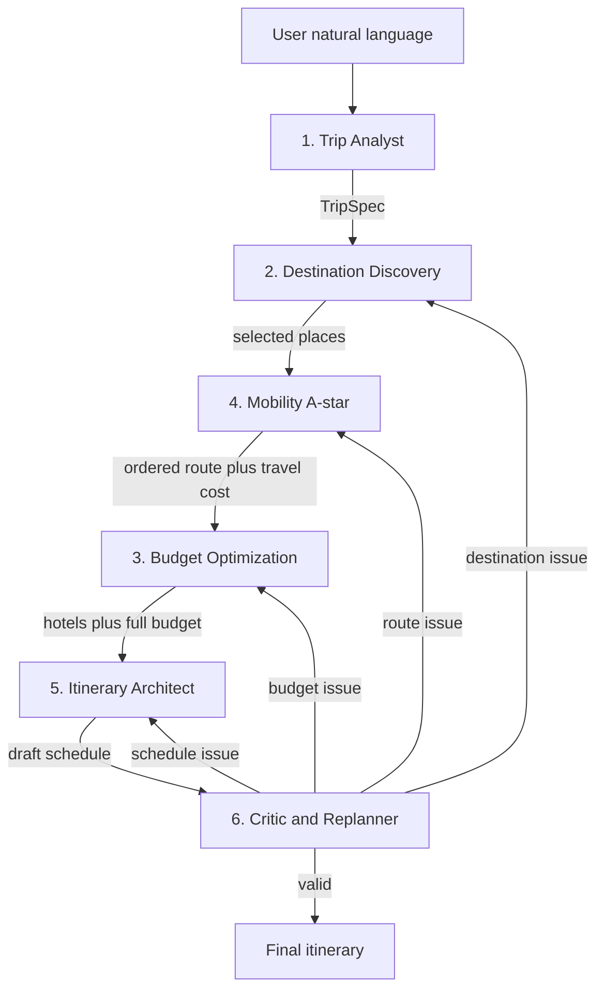

# Odyssey — Multi-Agent Adaptive Travel Planning System

## Architecture Overview



---

## Tech Stack

- **Backend**: FastAPI (Python 3.11+)
- **Agent Framework**: LangGraph `StateGraph` (linear specialists + Critic routing) + LangChain
- **LLM**: Gemini Flash via `langchain-google-genai`; model name comes from `GEMINI_MODEL` so the newest free-tier tool-calling Flash model can be selected without code changes
- **Fallback**: optional Groq model configured through environment variables; use only when the selected Gemini model is rate-limited
- **LangGraph checkpointing**: `MemorySaver` for local/demo; optional `AsyncPostgresSaver` later if persistence is needed
- **Observability**: LangSmith (free tier) — trace every agent step, visualize tool calls, inspect reasoning chains; set via `LANGSMITH_API_KEY` + `LANGSMITH_TRACING=true`
- **Algorithms**: weighted A* for city order; OR-Tools VRPTW/CP-SAT for day schedules; weighted-sum scorer (no scipy)
- **External APIs**:
  - **Mapbox**: map rendering, geocoding, road directions and travel-time matrices
  - **Foursquare Places**: attractions, categories, ratings and opening hours when available
  - **Gemini travel market**: hotels and long-haul airfares generated per destination (locations vary)
  - **OpenWeatherMap**: current weather + 5-day / 3-hour forecast
- **Database**: SQLite for saved itineraries (enough for the course demo)
- **Cache**: None
- **Demo fallback**: bundled Kerala seed dataset so the demo still works if live places/weather APIs miss coverage
- **Frontend**: Next.js 14 App Router (nodejs runtime) + Tailwind + shadcn/ui + Mapbox GL JS
- **Streaming**: Server-Sent Events — FastAPI `StreamingResponse` + LangGraph `astream(version="v2", stream_mode=[...])` → Next.js `TransformStream` route handler
- **Deployment**: local run only (no Docker for v1)

---

## The 6 Agents

### Agent 1 — Trip Analyst Agent
- **Input**: Free-form natural language string
- **Output**: Structured `TripSpec` (destination, dates, budget, travellers, preference weights, hard constraints)
- **LangChain pattern**: Structured output with Pydantic via `model.with_structured_output(TripSpec)`
- **Missing fields**: If destination, duration, or budget is missing, fill safe defaults and set `needs_clarification` in state. Do not use LangGraph `interrupt()` in v1 (it complicates SSE). Frontend can show the assumed defaults.
- **Tools**: `geocode_location` (Mapbox Geocoding API), `validate_trip_schema`

### Agent 2 — Destination Discovery Agent
- **Input**: `TripSpec` from state
- **Output**: Ranked candidate destinations + activities per destination with preference scores
- **LangChain pattern**: ReAct agent with `@tool(parse_docstring=True)` tools
- **Tools**:
  - `search_destinations` → Mapbox Geocoding + Foursquare Places API (`textsearch`)
  - `search_attractions` → Foursquare Places API (category-based nearby search)
  - `get_weather_forecast` → OpenWeatherMap current + 5-day forecast
  - `score_preference_match` → custom weighted cosine similarity (deterministic)
  - `get_place_photos` → Foursquare photos when credits allow, else Mapbox Static Images

### Agent 3 — Budget Optimization Agent
- **Input**: `TripSpec` + `selected_destinations` + `route` from Mobility (runs **after** Mobility so transport cost is included)
- **Output**: Cost breakdown, accommodation options, trade-off recommendations
- **LangChain pattern**: ReAct agent, uses `ToolRuntime` for state context injection
- **Tools**:
  - `search_hotels` → Gemini market list (seed/heuristic if LLM is off)
  - `search_hotel_offers` → cheapest quoted stay from that list
  - `calculate_activity_costs` → deterministic lookup table (category → avg cost by city tier)
  - `estimate_food_costs` → per-person-per-day by city tier
  - `validate_budget` → deterministic: compares itemized total vs. budget ceiling
  - `generate_tradeoff_options` → LLM-guided: "cheapest hotel saves ₹X at cost of Y preference score"

### Agent 4 — Mobility & Routing Agent
- **Input**: Selected destinations + trip spec
- **Output**: Ordered route, per-leg travel time, transport modes, per-leg costs
- **LangChain pattern**: ReAct agent; deterministic A* core, LLM selects transport strategy
- **Tools**:
  - `build_travel_graph` → NetworkX `DiGraph`, edges weighted by (time, cost, mode)
  - `astar_route_search` → weighted A* over `(location, visited_set, elapsed_time)` state; haversine heuristic; weight-escalation for anytime behavior
  - `get_directions` → Mapbox Directions API (road/walking/cycling duration; rail remains rules/seed data)
  - `search_flights` → Gemini airfare estimate only for **long-haul / intercity air** (not Kochi–Munnar; that is road)
  - `check_transport_availability` → rules engine (bus/train/taxi by region)
  - `calculate_route_cost` → per-mode cost estimator

### Agent 5 — Itinerary Architect Agent
- **Input**: Destinations, activities, routes, budget breakdown
- **Output**: Day-by-day, hour-level schedule
- **LangChain pattern**: Tool-calling agent; OR-Tools VRPTW is the scheduling core
- **Tools**:
  - `get_opening_hours` → Foursquare Places Details (hours field)
  - `solve_schedule_vrptw` → OR-Tools `pywrapcp.RoutingModel` (VRPTW): time windows per location = opening hours, travel time matrix from Mapbox, activity durations as service times, soft constraints for meal/rest breaks
  - `validate_time_windows` → post-solve overlap/gap detector
  - `score_itinerary` → multi-objective: `Score = w_p·P + w_q·Q + w_r·R + w_b·B − w_t·T − w_c·C`

### Agent 6 — Critic & Replanner Agent
- **Input**: Complete draft itinerary
- **Output**: `ValidationReport`; if invalid → `ReplanDirective` with targeted agent routing
- **LangChain pattern**: ReAct agent + LangGraph conditional edges (max 3 replan iterations)
- **Tools**:
  - `check_budget_violations` → deterministic comparison
  - `check_schedule_conflicts` → overlap/gap scan
  - `check_weather_disruptions` → OpenWeatherMap rain risk cross-referenced against itinerary days
  - `check_attraction_availability` → Foursquare hours/status when available; explicit closures come from disruption events or seed data
  - `check_transport_disruptions` → market airfare re-check
  - `generate_replan_directive` → LLM output: `{agent: "budget_agent", reason: "...", constraints: {...}}`

---

## Shared State (LangGraph)

```python
# orchestration/state.py
class TripState(TypedDict):
    # Input
    raw_input: str
    trip_spec: Optional[TripSpec]

    # Discovery
    candidate_destinations: List[Destination]
    candidate_activities: Dict[str, List[Activity]]

    # Optimization
    selected_destinations: List[Destination]
    route: Optional[Route]
    budget_breakdown: Optional[BudgetBreakdown]
    accommodation_options: List[Hotel]

    # Schedule
    draft_itinerary: Optional[Itinerary]
    final_itinerary: Optional[Itinerary]

    # Validation
    validation_report: Optional[ValidationReport]
    replan_directives: List[ReplanDirective]
    iteration_count: int

    # Live events
    disruptions: List[Disruption]
    agent_messages: Annotated[List[str], operator.add]  # streaming log
    conflicts: List[AgentConflict]  # Destination vs Budget vs Mobility disagreements
    optimization_score: float
```

---

## Algorithms

### A* Destination Ordering (`algorithms/astar.py`)
- **Why A* when Maps API exists**: Mapbox/Google gives you road directions between two chosen points (A→B). It does NOT decide the **order** to visit multiple cities (should Day 2 be Munnar or Thekkady?). That ordering problem requires search — that's A*.
- Two distinct layers:
  - **A* (meta-level)**: Finds the optimal order to visit N candidate destinations. Graph nodes = cities, edges = travel time from Mapbox Distance Matrix. State = `(current_city, frozenset(visited), elapsed_days)`. Heuristic = min remaining travel between unvisited cities.
  - **Mapbox Directions API (road-level)**: Once order is decided, gives actual road route, duration, and polyline for the map.
- Weight escalation: `f(n) = g(n) + (1 + ε)·h(n)` — anytime behavior, always returns a plan
- Used by: Mobility Agent

### VRPTW Scheduling (`algorithms/csp_solver.py`)
- Library: `ortools.constraint_solver.pywrapcp.RoutingModel` (Vehicle Routing with Time Windows)
- Nodes = activities + hotels; edges = travel time matrix from Mapbox Directions API
- Time windows per node = attraction opening hours (fetched from Foursquare)
- Service times = activity durations; vehicle capacity = daily hour budget
- Soft constraints: meal windows (penalty for violations), rest blocks
- Objective: Minimize travel time while maximizing preference-weighted activity score
- Used by: Itinerary Architect Agent

### Multi-Objective Scoring (`algorithms/optimizer.py`)
- Formula: `Score = w_p·P + w_q·Q + w_r·R + w_b·B − w_t·T − w_c·C`
- Weights personalized per traveler archetype (adventure / relaxed / budget)
- Used by: Itinerary Architect + Critic agents

---

## LangGraph Graph Topology

```python
# orchestration/graph.py
graph = StateGraph(TripState)
graph.add_node("trip_analyst", trip_analyst_node)
graph.add_node("destination_agent", destination_node)
graph.add_node("budget_agent", budget_node)
graph.add_node("mobility_agent", mobility_node)
graph.add_node("itinerary_architect", itinerary_node)
graph.add_node("critic_replanner", critic_node)

graph.set_entry_point("trip_analyst")
graph.add_edge("trip_analyst", "destination_agent")
graph.add_edge("destination_agent", "mobility_agent")
graph.add_edge("mobility_agent", "budget_agent")
graph.add_edge("budget_agent", "itinerary_architect")
graph.add_edge("itinerary_architect", "critic_replanner")

# Replan must not wait for a parallel join:
# dest issue  → Destination → Mobility → Budget → Architect → Critic
# route issue → Mobility → Budget → Architect → Critic
# budget issue → Budget → Architect → Critic
# schedule issue → Architect → Critic

# Targeted replan routing — max 3 iterations guarded by iteration_count
graph.add_conditional_edges("critic_replanner", route_after_critic, {
    "valid": END,
    "max_iterations": END,       # emit partial plan with warnings
    "replan_destination": "destination_agent",
    "replan_budget": "budget_agent",
    "replan_mobility": "mobility_agent",
    "rebuild_schedule": "itinerary_architect",
})

# Compile with MemorySaver for the course demo
app = graph.compile(checkpointer=MemorySaver())
```

---

## API Layer (FastAPI)

- `POST /api/plan` → starts LangGraph session, returns `thread_id`, begins streaming
- `GET /api/plan/{thread_id}/stream` → SSE stream; uses `graph.astream(version="v2", stream_mode=["messages","updates","custom"], subgraphs=True)`
- `POST /api/disrupt` → injects `Disruption` into live state via `graph.aupdate_state()` → triggers Critic replan
- `GET /api/itinerary/{thread_id}` → fetch finalized itinerary from checkpoint
- `GET /api/health` → readiness check

SSE event types (typed stream):
```json
{"type": "step_start",   "agent": "destination_agent", "message": "Searching destinations..."}
{"type": "tool_result",  "agent": "mobility_agent",    "tool": "astar_route_search", "data": {...}}
{"type": "step_complete","agent": "itinerary_architect","data": {...draft_itinerary...}}
{"type": "done",         "data": {...final_itinerary...}, "score": 0.87}
{"type": "error",        "agent": "budget_agent",       "message": "hotel search timeout, retrying..."}
```

Key FastAPI pattern: graph compiled **once at startup** via `lifespan`; `thread_id = user_id:session_id`; `X-Accel-Buffering: no` header for Nginx.

---

## Frontend (Next.js)

- `app/page.tsx` — Hero + natural language input form
- `app/plan/[threadId]/page.tsx` — Live planning view with agent progress + map
- `app/api/stream/route.ts` — Next.js Route Handler (`runtime = 'nodejs'`); proxies FastAPI SSE via `TransformStream`; forwards `req.signal` for clean disconnect
- `lib/useAgentStream.ts` — Custom hook: reads SSE chunks, `startTransition` throttles React re-renders
- `components/AgentTimeline.tsx` — Real-time SSE-driven agent status cards (running / done / error states)
- `components/ItineraryView.tsx` — Day-by-day accordion schedule with time slots
- `components/MapView.tsx` — **Mapbox GL JS** interactive map with destination markers + route polyline
- `components/DisruptionPanel.tsx` — "Simulate Disruption" controls (weather, closure, budget cut) for demo Part B
- `components/BudgetChart.tsx` — Cost breakdown bar chart (recharts)

---

## Repository Structure

```
backend/                 FastAPI + LangGraph
frontend/                Next.js 14 App Router
data/kerala_seed.json    Demo fallback dataset
PLAN.md
README.md
```

---

## Architecture verdict (locked)

Keep **exactly these 6 agents**. Do not add Hotel, Weather, Supervisor, or LLM Council agents.

That set is the right grain for a multi-agent trip planner:
- one parser, one explorer, one money optimizer, one mover, one scheduler, one critic
- hotels stay a **Budget tool**, weather stays a **Destination/Critic tool**
- Critic is the coordinator (routes which agent re-runs). A 7th supervisor would only add tokens

Do **not** fan-out Mobility and Budget in parallel. LangGraph would run Architect twice on first pass and can deadlock on targeted replan. Sequential Destination → Mobility → Budget also lets Budget include transport cost.

## PEAS (Review 1)

- **Performance**: feasible itinerary; maximize `Score = w_p P + w_q Q + w_r R + w_b B - w_t T - w_c C`; stay under budget and daily travel cap
- **Environment**: partially observable, dynamic, sequential, multi-agent; live APIs plus simulated disruptions
- **Actuators**: write TripState, emit itinerary, trigger targeted replan, ask user for missing fields
- **Sensors**: NL request, Mapbox, Foursquare, Gemini travel market, OpenWeatherMap, user HITL replies, disruption events

## Agent conflict protocol

When specialists disagree, they write an `AgentConflict` into shared state instead of overwriting each other:

```text
Destination: Munnar score 0.91
Budget: Munnar overshoots by 4000
Mobility: Munnar adds 3h travel
```

Critic picks the cheapest-damage repair (drop activity, cheaper hotel, swap city) and re-invokes only that agent.

## Demo reliability

Hotel/flight APIs are thin or unavailable for arbitrary Indian hill towns. `travel_market.py` asks Gemini for local hotels and airfares; if the LLM is off, it uses `data/kerala_seed.json` or a deterministic heuristic so Review 2 never dies on a 401.

---

## Rubric Coverage

- **PEAS**: Performance (optimization score), Environment (real APIs, dynamic disruptions), Actuators (itinerary + replan), Sensors (weather, places, transport)
- **Agent Analysis**: 6 agents, partially observable + dynamic + multi-agent environment
- **Algorithmic Modeling**: A* (routing), OR-Tools CSP (scheduling), multi-objective weighted scoring
- **Tool Selection**: LangGraph (`MemorySaver`, conditional routing), LangChain `@tool`, FastAPI SSE, Mapbox, Gemini travel market, OpenWeatherMap, OR-Tools VRPTW, NetworkX, Foursquare Places
- **Multi-Agent Interaction**: Shared `TripState`, sequential specialists, Critic conflict resolution and targeted replan
- **Demo**: Part A — normal 5-day Kerala planning; Part B — live disruption simulation with targeted replan
