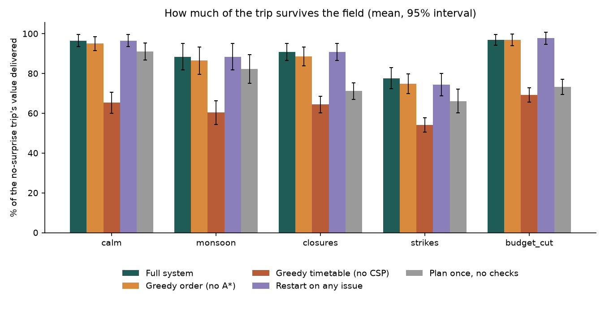

# Odyssey — Multi-Agent Travel Planner (deterministic version)

> This is the `simple-deterministic` branch: **no LLM, no external API, no API keys, no agent framework**. Every
> decision is a rule or an algorithm from the course, and a given request always meets the same world and gets the same
> plan. The LLM-and-APIs version is on `main`.

Six agents plan a trip together. They never call each other: they send addressed **messages** on a bus, each owns its
own part of a shared state and may not touch the rest, and a Critic sends every problem to the one agent that owns it.
The plan is made on **averages** (a month's typical weather). The world is not average, and the agents can only find
out what is real by **checking** an environment that answers just what it is asked. So when it rains hard on day 3, a
sight is shut, or a strike hits a travel day, only the agent responsible re-does its work.

```
traveller ─REQUEST─► Trip Analyst ─► Destination ─► Mobility ─► Budget ─► Itinerary Architect ─► Environment ─► Critic
                     (parse)        (cosine + UCS)  (UCS + A*)  (greedy)  (CSP: backtracking,    (field       │
                                                                            MRV, forward check)    check)      ├─ ACCEPT ─► traveller
                                                                                                               └─ REPLAN ─► the ONE agent that owns the issue
traveller ─EDIT─► Edit Router ─RERUN─► the earliest agent whose inputs changed          traveller ─DISRUPTION─► Critic
```

Full design (PEAS per agent, environment analysis, algorithms, conflict table, results, viva answers):
[`PLAN.md`](PLAN.md).

### Where each rubric line is evidenced

| Rubric line | Evidence |
|---|---|
| **PEAS Formulation** | `PLAN.md` §3: one PEAS table **per agent**, generated from the code (`GET /api/agents`) and checked by a test; one shared score formula |
| **Environment & Agent Analysis** | `PLAN.md` §4–5: seven environment properties, each with what it forces in the design (partially observable, stochastic but seeded, dynamic, sequential, multi-agent); agent type per agent, with why a simple reflex agent is not enough |
| **Algorithmic Modeling & Search Strategy** | `PLAN.md` §6: formal problem definitions; **UCS** (travel times), **A\*** with an admissible MST heuristic (visit order), a **CSP** with backtracking + MRV + forward checking (each day). All hand-written, each with a baseline and tests against brute force |
| **Tool/Package Selection & Setup** | `PLAN.md` §8 (what is used, what was rejected and why); pinned `requirements.txt`; `./setup.sh` then `./run.sh` |
| **Multi-Agent Execution & Interaction** | An explicit message protocol (15 message types) shown live in the UI; ownership of state enforced at run time; conflict table and Critic routing in `PLAN.md` §7; targeted replanning measured against restarting |
| **Demo Quality & Testing Scenarios** | The web UI with a live message log and a *Compare strategies* button; **126 tests**; 9 scenarios × 5 strategies × 30 seeds with paired statistics and charts in [`backend/results/`](backend/results/) |
| **Code Structure & Scalability** | One module per agent, algorithms as pure functions, a region is one JSON file, trips from 1 to 30 days; see the layout below |

## Run it

Requires Python 3.11+ and Node 18+. No keys.

```bash
./setup.sh          # creates backend/.venv, installs Python and npm packages
./run.sh            # backend on :8000 and the UI on http://localhost:3000
./run.sh tests      # 126 tests, about two seconds, fully offline
./run.sh experiments          # the strategy comparison (add --quick for 3 seeds)
```

Or by hand:

```bash
cd backend && python3 -m venv .venv && source .venv/bin/activate
pip install -r requirements-dev.txt            # requirements.txt is enough to run and test; -dev adds the charts
uvicorn api.main:app --reload --port 8000       # http://localhost:8000/docs

cd frontend && npm install && npm run dev       # http://localhost:3000
```

## Demo script (about five minutes)

1. **Plan, in a calm world.** Field: *Calm world*. "5 days in Kerala with 3 friends, around ₹40,000, nature and
   adventure at a relaxed pace". Watch the agents work; each row shows the tools and algorithms it ran (A\* nodes vs UCS
   nodes, CSP nodes and backtracks). The **Messages between agents** log shows every hand-off. The Critic sends the first
   draft back to Budget (over the ceiling), which goes one tier cheaper.
2. **The world surprises the plan.** Field: *Rough*, and a rainy month ("… from 2027-07-10"). A **Field check** row
   appears after the Schedule: the environment reports heavy rain on some days, the Critic sends **only the Architect**
   back (`REPLAN`), and the outdoor sights move to dry days. The stats line shows how many facts were checked.
3. **Events.** *Close ⟨city⟩* → the Critic messages Destination only; the other cities stay. *Cut budget* → Budget.
   *Transport issue* → Mobility.
4. **Change it by typing.** "make day 2 lighter" (→ Architect), "by train" (→ Mobility), "add Alleppey" (→ Destination),
   "how much does it cost?" (answered, plan unchanged).
5. **Does each part earn its place?** *Compare strategies on this trip*: the same trip and field planned five ways and
   scored against what really happens. Then show `backend/results/paired_gains.png`.

## Results (30 seeds per scenario)

Mean % of the no-surprise trip's value that survives the field. Full tables, paired statistics with 95% intervals, and
what the results do *not* show are in `PLAN.md` §9.

| Scenario | Full system | Greedy timetable (no CSP) | Restart on any issue | Plan once, no checks |
|---|---|---|---|---|
| calm | 96.5 | 65.3 | 96.5 | 91.2 |
| monsoon | 88.5 | 60.4 | 88.5 | 82.3 |
| closures | 90.8 | 64.5 | 90.8 | 71.2 |
| strikes | 77.6 | 54.1 | 74.3 | 66.1 |
| budget_cut | 97.0 | 69.3 | 97.7 | 73.3 |
| scale_12 | 89.4 | 67.3 | 80.2 | 69.8 |

- Checking the field and repairing beats planning once in all nine scenarios (+5 to +24 points, significant each time).
- The CSP beats a first-fit timetable by 22 to 33 points everywhere.
- Restarting reaches the same value but needs 1.5 to 4.7 more agent runs per trip (targeted replanning is cheaper).
- A\* over nearest-neighbour shows in the search comparison (48 vs 854 nodes at 8 cities; greedy misses the optimum from
  5 cities) but barely end to end: trips this small rarely visit enough places for the order to matter. Reported as is.



## Tests and experiments

```bash
cd backend
pytest -q                                          # 126 tests
python -m experiments.run_experiments              # 1,350 runs, tables + charts into backend/results/
python -m experiments.run_experiments --replot     # rebuild the tables and charts from results.csv
python -m experiments.search_comparison            # A* vs UCS vs greedy on every subset of cities
```

The tests cover the algorithms (A\* against brute force, the heuristic never overestimating, the CSP's constraints), each
agent's rules, the message chain, ownership of state (an agent that writes or reads outside its declaration fails), the
field (reproducible, seed-dependent, measured frequencies), the strategies, the experiment harness, the HTTP API the UI
uses, and that `PLAN.md` matches the code.

## API

| Method | Path | Purpose |
|---|---|---|
| `POST` | `/api/plan` | Start a plan `{message, strategy?, uncertainty?, seed?}`; returns `{thread_id}` |
| `GET` | `/api/plan/{id}/stream` | Server-sent events: `message` (every bus message), `step_start`, `step_complete` (with the tools and algorithms), `done`, `error` |
| `POST` | `/api/disrupt` | Report a closure / weather / transport / budget-cut event, then reconnect to the stream |
| `POST` | `/api/revise` | Change the plan with a sentence, then reconnect to the stream |
| `POST` | `/api/compare` | Run every strategy on this thread's request, field and events; scored against the truth |
| `GET` | `/api/itinerary/{id}` | The current plan and the whole message log |
| `GET` | `/api/agents` | Role, architecture, PEAS, reads and writes of every agent |
| `GET` | `/api/health` | Status, regions, strategies |

## Layout

```
backend/
  core/         messages.py (the protocol), blackboard.py (ownership), team.py (the runtime), environment.py (the field),
                strategies.py, metrics.py, compare.py
  agents/       one module per agent (a class with role, PEAS, reads, writes) + base.py
  algorithms/   search.py (UCS), astar.py (A*, MST heuristic, greedy), csp_solver.py (CSP + first-fit), planning.py, optimizer.py
  tools/        world.py (the dataset, UCS travel times, weather), costs, scoring, validators
  data/         kerala.json: the whole world (a new region is a new file)
  experiments/  scenarios.py, run_experiments.py, search_comparison.py
  results/      the CSVs and charts the experiments wrote
  api/          FastAPI routes and the event stream
  tests/
frontend/       Next.js UI: agent timeline, message log, day-by-day plan, budget chart, map, strategy comparison
PLAN.md         the design document
```

## Known limitations

- One region (Kerala). The data is approximate and illustrative; hotel names and prices are placeholders. Other places get a
  question back, not a plan.
- Weather is a monthly average; the surprises are a seeded model, not real forecasts.
- Request and edit parsing is rule-based: unusual phrasing gets a "here is what I can change" reply.
- A strike on a day that must be driven, where no train runs, cannot be avoided; the Critic reports it.
- Each agent optimises its own part given the earlier ones, so the joint plan is not globally optimal; the Critic's loop
  repairs it, it does not search the whole space.
- With no start date the plan starts two weeks from today, so a request without a date can change with the calendar.
  Give a date and it never does.
- Plans are kept in memory: restarting the backend forgets them.
