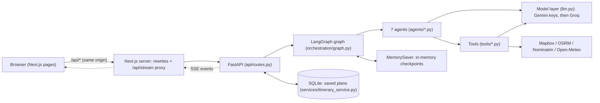
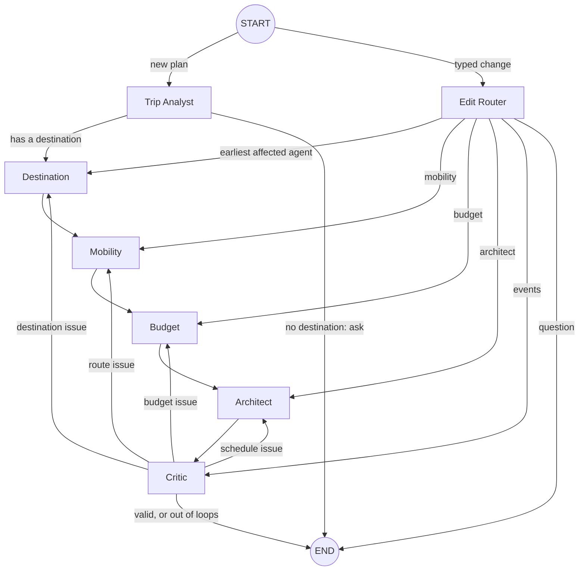

# How Odyssey works — a request from click to itinerary

Branch `main` (LLM agents with live APIs). This explains the running system in detail: what happens for one request, what each agent reads, asks the model, computes and writes, and what happens when something fails or changes. File names and function names are given so every step can be found in the code.

Contents: [1 The system in one picture](#1-the-system-in-one-picture) · [2 One request, step by step](#2-one-request-step-by-step) · [3 The shared state](#3-the-shared-state) · [4 The model layer](#4-the-model-layer-llmpy) · [5 The tools](#5-the-tools) · [6 The agents](#6-the-agents-one-by-one) · [7 Algorithms](#7-the-algorithms-in-detail) · [8 Replanning, worked through](#8-replanning-worked-through) · [9 Streaming and the UI](#9-streaming-and-the-ui) · [10 Saving plans](#10-saving-plans) · [11 What happens when things fail](#11-what-happens-when-things-fail) · [12 Behaviours worth knowing](#12-behaviours-worth-knowing) · [13 Where to look](#13-where-to-look)

## 1. The system in one picture

Three ideas run through everything:

1. **The model chooses, code computes.** A language model decides *which* cities to keep, *how* to travel each hop, *which* agent to re-run, and what a typed change means. The visiting order, the timetable, every price total and the score are computed by deterministic code. A model reply is always validated and bounded before use.
2. **One shared state.** Every agent reads and writes one `TripState`. Nothing is passed between agents directly.
3. **Targeted replanning.** After each plan the Critic validates and, if something is wrong, names exactly one agent to re-run. A change never restarts the whole plan.

## 2. One request, step by step

The request: *"5 days in Kerala with 3 friends, ₹40,000, nature and adventure, relaxed pace."*

| # | What happens | Where |
|---|---|---|
| 1 | The landing page stores the text in `sessionStorage` under a new thread id and navigates to `/plan/<thread>` | `frontend/app/page.tsx` |
| 2 | The plan page finds the stored text and calls `POST /api/plan {message, thread_id}` | `frontend/lib/useAgentStream.ts` |
| 3 | The backend puts `initial_state(message)` in a dict of pending runs and returns the thread id. **Nothing runs yet** | `api/routes.py: create_plan` |
| 4 | The page opens `GET /api/stream?threadId=…`. Next.js forwards it to `GET /api/plan/{id}/stream` and passes the bytes through | `frontend/app/api/stream/route.ts`, `api/routes.py: stream_plan` |
| 5 | The stream handler pops the pending state and starts `graph.astream(state, config={thread_id}, stream_mode=[messages, updates, custom])` | `api/sse.py: stream_graph_run` |
| 6 | The graph enters at `START`; `route_entry` sees no edit request and goes to **Trip Analyst** | `orchestration/routing.py` |
| 7 | Analyst → Destination → Mobility → Budget → Architect run in that fixed order. After each node LangGraph emits an `updates` chunk; the stream turns it into `step_start` and `step_complete` events, with the agent's one-line message and its tool and algorithm chips | `orchestration/graph.py`, `api/sse.py` |
| 8 | **Critic** validates. If valid, or out of loops, the graph ends. Otherwise a conditional edge sends the state to the one agent it named, and the chain from that agent to the Critic runs again | `route_after_critic` |
| 9 | When the graph ends, the handler reads the final state, builds the `done` event (itinerary, budget, route, score, issues, cities…) and saves it to SQLite | `serialize_final_state`, `save_plan` |
| 10 | The browser has been updating the timeline live. On `done` it shows the results: map, day-by-day plan, budget chart, edit box, disruption buttons | `frontend/app/plan/[threadId]/page.tsx` |

Changing the plan later repeats the same shape: `POST /api/revise` (a typed change) or `POST /api/disrupt` (a reported event), then the stream is opened again. Steps 6 to 9 run from a different entry point (section 8).

## 3. The shared state

`orchestration/state.py: TripState` is a typed dictionary. LangGraph merges each node's returned dictionary into it after the node runs, and stores a checkpoint per thread (`MemorySaver`), which is what lets a later disruption or edit resume the same plan.

| Field | Written by | Read by | Meaning |
|---|---|---|---|
| `raw_input` | request | Analyst | The traveller's sentence |
| `trip_spec` | Analyst (Edit Router updates it) | every agent | Region, arrival city, days, people, budget, interest weights, pace, limits, start date, what was assumed |
| `candidate_destinations` | Destination | Edit Router | All ranked cities with score and weather |
| `selected_destinations` | Destination | Mobility, Budget, Architect, Critic | The stops chosen |
| `candidate_activities` | Destination | Budget, Architect, Edit Router | Sights per selected city |
| `route` | Mobility | Budget, Architect, Critic | Order, legs (mode, hours, price), totals, A\* statistics, return leg |
| `budget_breakdown` | Budget; the Architect rewrites its activity line | Critic, UI | Hotels, food, activities, transport, total, ceiling, over-budget amount |
| `accommodation_options`, `stay_plan`, `excluded_activity_ids` | Budget | Architect, Critic | Hotels considered; days and nights per city; sights dropped for cost |
| `draft_itinerary` | Architect | Critic | The day-by-day schedule and score |
| `final_itinerary` | Critic | UI | The draft, once accepted (or returned best-effort) |
| `validation_report`, `replan_directives`, `iteration_count`, `conflicts` | Critic | agents sent back, Critic | Issues found, the routing decision and its reason, how many loops so far, recorded disagreements |
| `disruptions` | the API (`/api/disrupt`), the Edit Router | Destination, Mobility, Budget, Critic | Reported closures, storms, strikes, budget cuts |
| `edit_request`, `edit_directive`, `edit_locks`, `assistant_reply` | the API, Edit Router | every agent (locks) | A pending typed change, what it meant, the traveller's standing choices, an answer or a question for the traveller |
| `agent_messages`, `agent_meta` | every agent | the stream | The line and the chips shown in the timeline (`agent_messages` accumulates; `agent_meta` is per node) |
| `optimization_score` | Architect | UI | The multi-objective score |

**Standing choices (`EditLocks`)** deserve a note: pinned and excluded cities, preferred travel mode, hotel preferences, skipped sights, pinned sights (name → day), free days, light days, pace, start hour. Every agent reads them, so a later replan never undoes an edit.

## 4. The model layer (`llm.py`)

### Providers and failover

- Providers, in order: each Gemini key (named `gemini`, `gemini-2`, …) through Google's own SDK, then Groq through LangChain. Keys come from `GEMINI_API_KEY` (comma-separated) and `GROQ_API_KEY`.
- Gemini goes through Google's SDK because the LangChain client drops the "thought signatures" Gemini 3 needs to continue a tool call. Each Gemini call has a 60-second timeout so one hung request cannot freeze a plan; Groq has a 60-second timeout too, and no retries of its own.
- **Rate limits.** An error mentioning 429, quota or rate limit puts that provider on cooldown for the wait the provider asked for ("try again in 6.5s", "retry_delay"), else 20 s, plus 1 s, capped at 15 minutes. The call moves to the next ready provider.
- If **every** provider is cooling down and the shortest wait is at most 70 s, the call sleeps for that wait and tries again (up to 3 rounds), instead of failing.
- `GET /api/health` reports each provider as `untried`, `answered` or `cooling_down`, with `retry_in_seconds` and the last error. A configured key is not a working key, so this is the live truth.

### The decision loop (`llm_decide`)

Every model call an agent makes is `llm_decide(llm, tools, system, user, max_rounds)`:

1. The provider's runner starts a conversation with the system instructions and the user prompt.
2. **Tool rounds.** The model may ask to call the tools bound to that agent. Each call is executed by `_run_tool` (an error becomes `{"error": …}` for the model to read) and the result, truncated to 4,000 to 6,000 characters, is sent back. The **last round has no tools**, so the model must answer.
3. The final text is parsed by `parse_json_blob` (raw JSON or a fenced block; the outermost braces if there is prose around it).
4. An empty or unparseable reply is **not accepted as an answer**. It marks that provider "unparseable reply" and the loop tries the next provider.
5. A malformed tool call is retried once without tools. If strict JSON mode rejects a reply it is retried in plain mode.
6. The decision carries `_tool_calls` (the names of the tools the model actually called) so the UI can show them.
7. Failure returns `{}`.

`llm_json` is the same loop with no tools and one round, used for plain lookups (places, hotels, quotes, food price).

### What "no decision" means for each agent

| Agent | With no model answer |
|---|---|
| Trip Analyst | Raises `MODEL_UNAVAILABLE`: nothing is planned, the stream sends an `error` event |
| Destination | If it cannot list places, raises `MODEL_UNAVAILABLE`. If only its final choice fails, the heuristic ranking picks the cities |
| Mobility | Every hop stays on the road, in a taxi (an own car when nothing else was chosen) |
| Budget | Uses the heuristic tier from budget per person; hotels still come from the model, and none means no hotels |
| Architect | Makes no model call at all, but needs the sights the model listed |
| Critic | Uses its own ranking of issues to pick the target |
| Edit Router | Cannot read the change: the plan is left alone and it says so |

## 5. The tools

A *tool* is a plain function decorated for LangChain (`@tool`). Some are bound to the model for an agent to call; some are called directly by code. Results that come from a model or a service are cached in module dictionaries with no expiry (cleared between tests, not between server restarts), and a **failed lookup is never cached**.

| Tool | Used by | Source | If it fails |
|---|---|---|---|
| `search_destinations(region)` | Destination (code) | The model lists 6 to 9 real places with coordinates, theme scores and a description; coordinates are checked against a geocoder | Empty → the plan stops with a message |
| `search_attractions(destination, category, lat, lng)` | Destination (code and model) | The model lists 6 to 10 sights with entry fee, duration, rating, opening and closing hour, coordinates | Empty → that city has no sights |
| `search_hotels(destination, tier)` | Budget (code and model) | The model lists 5 real hotels with prices | Empty → no hotel for that city |
| `search_public_transport(origin, destination, mode, date)` | Mobility (model and code) | The model quotes one adult's door-to-door time and fare; a town without an airport or station is quoted with the ride to the nearest | `available: false` (not remembered) |
| `estimate_food_costs(days, travellers, tier, region)` | Budget | The model gives a per-person daily food price, accepted only between ₹150 and ₹4,000 | A flat default per tier: ₹500, ₹900, ₹1,800 |
| `geocode_location(place)` | several | Mapbox, then OpenStreetMap's Nominatim | `not_found`, coordinates `None` |
| `get_directions(origin, destination)` | Destination, Mobility | Mapbox driving directions; else OSRM, whose free-flow time is multiplied by 1.4 | `source: "unavailable"`, zero hours (never invented) |
| `travel_time_matrix(points)` | Architect | Straight-line distance at 25 km/h with a 5-minute minimum, because a day's stops are a few km apart | Not applicable |
| `trip_weather(place, start, days)` | Destination, Architect | Open-Meteo: a real forecast for days within 15 days, otherwise the same calendar dates last year, per day with rain and temperature; a day is "rainy" at 5 mm or 60% chance | `"unavailable"`; never fails a plan |
| `check_weather_disruptions`, `check_transport_disruptions` | Critic and Mobility (model) | Built on `trip_weather`. The weather check reports places with rain or a thunderstorm on the trip dates; the transport check reports a thunderstorm, violent rain or heavy snow | Empty result |
| `score_preference_match(prefs, scores)` | Destination | Cosine similarity of the seven-theme vectors | — |
| `estimate_road_cost`, `estimate_local_transport`, `calculate_activity_costs`, `calculate_route_cost` | Mobility, Budget | Arithmetic: own car ₹8/km, taxi ₹12/km, tempo traveller ₹25/km per 12 seats, bus ₹2.5/km per seat; local transport ₹500/day per group of four | — |
| `validate_budget`, `generate_tradeoff_options` | Budget, Critic | Compare a total with a ceiling; list ways to close a gap | — |
| `check_schedule_conflicts` | Architect, Critic | Overlaps between items and any day longer than 14 hours | — |
| `validate_trip_schema` | Analyst (model) | Checks a candidate spec against `TripSpec` | Errors returned to the model |
| `get_plan_day`, `find_in_plan`, `list_alternative_cities` | Edit Router (model) | Read-only views over the current plan | — |

(Foursquare helpers exist in `tools/foursquare_api.py` but are not used: its nearby search returns every kind of venue, not only sights.)

## 6. The agents, one by one

Each agent below is a LangGraph node function taking the state and returning the fields it changes. The graph order for a new plan is fixed: **Analyst → Destination → Mobility → Budget → Architect → Critic.**

### 6.1 Trip Analyst — `agents/trip_analyst.py`

**Job.** Turn the sentence into a `TripSpec`. It plans nothing.

**Runs.** First on a new plan. Never re-run by the Critic; the Edit Router changes the spec directly.

**Reads.** `raw_input`.

**Steps**
1. Ask the model (`llm_decide`, tools `geocode_location` and `validate_trip_schema`) with today's date and the request, using the instruction "you are the parser, not the planner". It must reply with JSON: `destination_region`, `clarifying_question`, `origin_city`, `duration_days`, `travellers`, `budget_inr`, `start_date`, `preferences` (seven themes, 0 to 1), `constraints` (pace, daily travel hours, max destinations), and `assumed` (which of duration, travellers, budget it had to fill in).
2. **Validate and bound.** A reply with neither a region nor a question is rejected. Duration is clamped to 1–30 (default 5), travellers at least 1, budget defaults to ₹40,000; `null` values are dropped so defaults apply; `assumed` keeps only duration, travellers and budget. The whole dictionary must pass `TripSpec` validation.
3. **Finalize.** A start date that is missing, malformed or in the past is replaced by today + 14 days and reported as an assumption. The daily travel limit is bounded to 2–8 hours, the number of stops to 1–5, and an unknown pace becomes `moderate`.
4. If the model gave no usable answer, raise `MODEL_UNAVAILABLE`.
5. If there is no destination, store the question in `assistant_reply`; the graph ends (`route_after_analyst` → `ask`) and the UI asks it.

**Writes.** `trip_spec`, `assistant_reply`, `agent_meta`, `agent_messages` ("parsed request → Kerala, 5 days, ₹40000 for 4 traveller(s) (assumed: start_date)").

**Guards.** "Never invent a destination": an implausible place (fictional, or a holiday that is impossible) gets a question, not a guess; the region is never defaulted to Kerala unless the traveller asked for it.

### 6.2 Destination Discovery — `agents/destination_agent.py`

**Job.** Choose which cities to visit and load their sights.

**Reads.** `trip_spec`, `disruptions`, `edit_locks`, `replan_directives` (why it was sent back), `selected_destinations` (on a replan).

**Steps**
1. **Build the block list.** Cities to avoid = closure and weather disruptions + cities the Critic said to avoid + cities the traveller excluded + the arrival city (it is how they arrive, not a stop).
2. **List candidates.** `search_destinations(region)` (model, cached). If it returns nothing, the plan stops with `MODEL_UNAVAILABLE`; nothing is invented.
3. **Score every candidate in parallel** (8 workers): cosine similarity between the traveller's interest vector and the city's theme scores; weather for the trip dates; a disrupted city's score is multiplied by 0.15; a city is flagged `weather_risk` if rain is likely on at least 40% of the days.
4. **Heuristic pick.** Number of stops = `min(max_destinations, days ÷ 2)`, at least 1 and never more than the days. Cities the traveller named are always stops (a "New Delhi" match counts for "Delhi"); the requested place is always a stop. Otherwise take the best-ranked city and those within one day's drive of it (straight-line distance ≤ daily hours × 50 km).
5. **Pinned cities** (from an earlier edit): keep exactly those (geocoding one the discovery did not list), replacing only one that has become unavailable.
6. **Otherwise ask the model** (`llm_decide`, tools `search_attractions` and `get_directions`). It sees the region, days, stop limit, daily travel limit, the interests, disrupted places, the reason it was sent back (if any), and the top eight candidates with their scores and weather. It replies `{"selected": [...], "reasoning": "..."}`. Its picks are matched to viable cities; cities the traveller named are always kept; if nothing usable comes back the heuristic pick stands.
7. **Load sights** for each chosen city in parallel (4 workers): `search_attractions`. Sights that are disrupted or excluded by the traveller are dropped; each sight's preference score is the larger of the model's score and the cosine match of its category; missing coordinates fall back to the city's; a sight listed under two cities is kept once, at the first.

**Writes.** `candidate_destinations`, `selected_destinations`, `candidate_activities`, `excluded_activity_ids` (reset to empty), `agent_meta`, `agent_messages`.

**When sent back.** It sees the Critic's reason, and an `avoid` list (a far city, a city with no hotel).

### 6.3 Mobility & Routing — `agents/mobility_agent.py`

**Job.** Order the chosen cities, and choose road, rail or air for every hop, including the journey there and home.

**Reads.** `selected_destinations`, `trip_spec`, `disruptions`, `edit_locks`, `replan_directives`.

**Steps**
1. **Road quotes.** For every ordered pair of chosen cities, `get_directions` (Mapbox, else OSRM). A city with a reported transport strike makes any hop touching it five times slower and three times dearer.
2. **Visiting order.** Build a graph of those road times and run the weighted A\* search from **every** possible start city; keep the order with the least total time (details in section 7.1). The daily travel limit steers it.
3. **The hops.** Arrival city → first stop (if the traveller said where they travel from), each consecutive pair, and last stop → home. Each gets its road quote.
4. **Ask the model for modes** (`llm_decide`, tools `search_public_transport` and `check_transport_disruptions`). It is told the request, the preferred mode, the group, the date, the total budget "for everything", every hop with its road distance, time and its cost in each vehicle (own car, taxi, tempo traveller, bus), and any strikes. It replies `{"modes": {"A|B": "road|rail|air"}, "road_vehicle": "…", "reasoning": "…"}`. Its instructions: short drives stay on the road; call the transport tool before choosing rail or air; on a tight budget prefer a train; never fix a budget with a very long drive.
5. **Apply the traveller's choice.** A preferred mode from an edit overrides the model for every hop. If the model named no road vehicle, a plan with flights or trains uses a taxi (someone who flew in has no car) and an all-road plan uses their own car.
6. **Build each leg, with a guard.** A road hop longer than the daily limit is **not accepted**, unless the traveller asked for road: look up the air and rail quotes and take the fastest, but only if it is at most 60% of the drive time. If no quote is available it stays on the road. Air and rail are priced per seat times travellers. A road hop is priced for the whole group by the chosen vehicle (cars counted per four people; a strike multiplies the price).
7. Totals for distance, hours and cost; `return_leg` is kept separately.

**Writes.** `route` (order, legs, totals, the A\* algorithm name and nodes expanded, return leg), `agent_meta` (A\* statistics; the mode chosen for each hop), `agent_messages`.

### 6.4 Budget Optimization — `agents/budget_agent.py`

**Job.** Price hotels, food, sights and transport against the ceiling, and repair an overrun.

**Reads.** `trip_spec`, `selected_destinations`, `route`, `candidate_activities`, `disruptions` (budget cuts), `edit_locks`, the previous `budget_breakdown`.

**Steps**
1. **Ceiling.** The trip budget, or the newest reported budget cut.
2. **Heuristic tier** from budget per person: under ₹8,000 budget, over ₹20,000 premium, otherwise mid.
3. **Ask the model** (`llm_decide`, tools `search_hotels` and `estimate_food_costs`) for `{"tier": …, "drop_activities": […], "reasoning": …}`, told the ceiling, people, days, cities, the between-city fares (local autos are added on top), the heuristic tier, and: if the previous plan was over budget, "choose a cheaper tier". A tier outside the three is ignored.
4. **Stay plan.** `plan_stays` splits the days over the ordered cities: one day each, a city reached by a transfer of eight hours or more spends its first day travelling, extra days go to the cities with the most sights left; nights = days, minus one for the last city. The Architect schedules from this same plan, so the bill matches the schedule.
5. **Hotels.** `search_hotels` for each city in parallel. One hotel per city: the traveller's choice ("cheapest", "best", or a name) always wins; otherwise the tier decides (budget = cheapest, mid = the middle one, premium = best rated). Rooms = people ÷ 2, rounded up.
6. **Costs.** Hotels = price × nights × rooms. Food priced for the region and tier. Transport = the between-city fares + ₹500 a day per group of four. Sights: only those that can fit (pace × the city's sightseeing days), the most preferred first.
7. **Model's drops.** Sights the model named are removed, keeping at least one per city.
8. **Repair if over the ceiling.** Drop the lowest-value paid sights, one at a time, but only if that could close the gap and always keeping one per city; then switch hotels the traveller did not choose to the cheapest.
9. **Report.** `validate_budget`; if still over, `generate_tradeoff_options` and a one-sentence model explanation of which trade-off hurts least.

**Writes.** `budget_breakdown` (line items, selected hotels, ceiling, over-budget amount, suggestions), `accommodation_options`, `excluded_activity_ids`, `stay_plan`.

### 6.5 Itinerary Architect — `agents/itinerary_architect.py`

**Job.** Turn cities, sights and hotels into a timed schedule for every day. It makes **no model call**.

**Reads.** `route`, `stay_plan`, `candidate_activities`, `excluded_activity_ids`, `budget_breakdown`, `trip_spec`, `edit_locks`.

**Setup.** Pace sets the day: relaxed 09:00–18:00 with 2 sights, moderate 08:00–21:00 with 3, packed 07:00–22:00 with 4 (a later start from an edit shifts the start, never earlier). Each city's sights are sorted by preference; the weather for the city's days is fetched once.

**For each day of each city block**
1. **The window.** On the first day in a city reached by a transfer, the day starts after the journey plus a buffer (0.5 h by road, 1.5 h by rail or air); on the last day, if the traveller travels home, it ends early by the return journey plus its buffer.
2. **The kind of day.**
   - A block flagged as a travel day (a transfer of eight hours or more) is a **travel** day.
   - A window shorter than two hours is a **travel** day.
   - A day the traveller made free is **leisure**.
   - Otherwise **sightseeing**.
3. **Pick candidates.** A light day allows one sight, otherwise the pace's number. Pinned sights for this day go first; sights pinned to other days are left out; sights that cannot fit their opening hours inside today's window are dropped. On a **rainy day** the outdoor sights (nature, adventure) are down-weighted (×0.4) so indoor ones come first, and the day notes it.
4. **Solve the day** (section 7.2): OR-Tools routing with time windows over the candidates, lunch and dinner; the travel matrix is straight-line at city speed. If **none** of the candidates fit, try the next slice of sights (up to about three times the cap) until something schedules.
5. **Record.** Scheduled sights and meals become items with times; sights used leave the pool so no sight repeats; a day that ends with no sights becomes **travel** (if it began with a transfer) or **leisure**; the day carries its weather, the transfer leg, and an overnight hotel (none on the last day).

**After all days.** `check_schedule_conflicts` counts problems; the multi-objective **score** is computed (section 7.4); Budget's activity estimate is replaced by the cost of what was actually scheduled, and the total is updated.

**Writes.** `draft_itinerary`, `optimization_score`, `budget_breakdown` (with the real activity cost), `agent_meta` (days solved), `agent_messages`.

### 6.6 Critic & Replanner — `agents/critic_replanner.py`

**Job.** Validate the draft; if it fails, name exactly one agent to re-run. It never rewrites the plan and never restarts the Analyst.

**Reads.** The whole plan, `disruptions`, `iteration_count`, `edit_locks`, `replan_directives`, `edit_directive`.

**Step 1 — find issues (code).**

| Issue | Condition | Goes to |
|---|---|---|
| `BUDGET` | Total above the ceiling (a reported cut lowers the ceiling) | Mobility if fares are at least 40% of the ceiling, otherwise Budget |
| `SCHEDULE_CONFLICT` | Overlapping items or a day over 14 hours | Architect |
| `NO_HOTEL` | An overnight stay with no hotel | Budget |
| `NO_BASE` | Still no hotel after Budget looked again | Destination, told to avoid that city |
| `LEISURE_DAY` | A day with nothing left to see that the traveller did not ask for | Destination |
| `ALL_TRAVEL` | No sight fits anywhere | Mobility |
| `LONG_ROAD_TRIP` | The journey there or home is a drive over the daily limit and road was not asked for | Mobility |
| `NO_ROUTE` | A hop with no way to travel | Destination, told to avoid the far city |
| `TRAVEL_OVERLOAD` | A hop over the daily limit | Destination |
| `WEATHER`, `CLOSURE`, `TRANSPORT` | The traveller reported one at a city that is in the plan | Destination, Destination, Mobility |

**Step 2 — decide what to do.**
1. If there are no issues: **valid**, `final_itinerary` = the draft, disruptions cleared.
2. Else if this was the last allowed pass (`iteration_count + 1 ≥ MAX_REPLAN_ITERATIONS`, default 3): **best effort**, the draft is returned with the issues listed.
3. Else if every issue was already retried (an issue is not sent again after its agent had a go), or an edit is in progress and the only issues are plan-quality ones that an edit must not re-open (`LEISURE_DAY`, `TRAVEL_OVERLOAD`, `ALL_TRAVEL`, `NO_BASE`): **return as it stands**.
4. Otherwise **route**. Issues are sorted so that what the traveller reported comes first, then by severity. The top issue's own target is the default.
5. **Ask the model** (`llm_decide`, tools `check_weather_disruptions` and `check_transport_disruptions`, to verify a reported event) which of `destination_agent`, `budget_agent`, `mobility_agent`, `itinerary_architect` to call for "the cheapest-damage repair". If it names one of those, that overrides the default. The reason is passed on.
6. Write a `ReplanDirective(target_agent, reason, constraints={issue, avoid})`, add 1 to the loop count, and record an `AgentConflict` if the budget is over (Destination's best city against Budget's overrun).

**Writes.** `validation_report`, `replan_directives`, `iteration_count`, `conflicts`, `final_itinerary`, `disruptions` (cleared when the run ends), `agent_meta`, `agent_messages`.

### 6.7 Edit Router — `agents/edit_router.py`

**Job.** The front door for changes to an existing plan. The Critic only reacts to problems it can detect, so it cannot read "make day 2 lighter".

**Runs.** When `edit_request` is set: the graph's entry point `route_entry` sends it here instead of to the Analyst.

**Steps**
1. **Read the plan** through a context object (trip, cities, route, budget with hotels, days with activities, standing instructions) and read-only tools (`get_plan_day`, `find_in_plan`, `list_alternative_cities`, `geocode_location`).
2. **Ask the model** (up to five rounds) to classify the message and reply with JSON: `intent` (modify or answer), `route_to` (the earliest agent whose inputs the change touches: destination, mobility, budget, architect, critic, or answer), a summary, a reply for a question, a `spec_patch` (days, budget, travellers, start date, arrival city, region, pace, interest weights), cities to add or remove, `lock_updates` (mode, hotels, skipped sights, pinned sights, free days, light days, pace, start hour) and `disruptions` (real-world events).
3. **Validate.** Types are coerced; a wrong `intent` is rejected. If no valid decision arrives, the reply is "I couldn't reach the language model… your plan is unchanged".
4. **Sanitize.** Every name is matched against the plan (exact, then containment); a city, sight or hotel that is not in the plan is dropped and reported ("couldn't find X"); days outside the trip are dropped; numbers are bounded (days 1–30, budget > 0, dates not in the past).
5. **Apply.** The spec changes; locks are merged with earlier ones (lists are unioned, dictionaries overwritten); a tweak to interests pins the current cities so a taste change does not swap them out; adding or removing a city pins or excludes it (a city that is added is resolved by Destination when it re-runs: taken from the discovery, or geocoded; one it cannot find is dropped there).
6. **Choose the entry point, with a rule the model cannot break.** Each kind of change has a level (the first agent that must re-run): interests, trip length, cities, region or arrival city → Destination; travellers, start date, travel mode → Mobility; hotels, budget → Budget; pace, free or light days, skipped or pinned sights, start hour → Architect; reported events → Critic. The entry is `min(the model's choice, the earliest level)`: it may re-run **more** than needed, never less.
7. **Answer only.** A question, or "nothing needed to change", ends here with a reply and the plan untouched.

**Writes.** `trip_spec`, `edit_locks`, `edit_directive`, `disruptions`, `assistant_reply`, and resets `iteration_count`, `replan_directives`, `final_itinerary`.

After it, `route_after_edit` sends the run to the chosen agent, and the normal chain runs on to the Critic.

## 7. The algorithms in detail

### 7.1 Visiting order — weighted A\* (`algorithms/astar.py`)

- **Graph.** `build_travel_graph`: a complete directed graph over the chosen cities; each edge carries road hours, cost, distance and mode. A pair with no road quote gets 999 hours so it is never mistaken for a cheap hop.
- **State.** `(current city, set visited, hours travelled today)`; the "today" component is bucketed to 0.1 hour so the search can tell "arrive tired" from "arrive fresh".
- **Expansion.** From a state, go to each unvisited city. The hop's time is added to `g`. If the hop is longer than the daily limit, a penalty of 50 is added to `f` (not to `g`), so such a hop is avoided unless nothing else works.
- **Heuristic.** `h` = the cheapest direct edge from the current city to any unvisited city. It is a lower bound on the next hop.
- **Priority.** `f = g + penalty + (1 + ε)·h`, with `ε = 0` at first.
- **Anytime behaviour.** After 4,000 expansions `ε` rises (by 4, up to 20) so the search leans on `h` and finishes; after 12,000 it stops and takes the best partial order it has found and appends the missing cities. The result reports which of these happened (`weighted_astar`, `weighted_astar_anytime_fallback`, `trivial_fallback`) and how many nodes were expanded.
- **Every start.** Mobility runs it from each city as the start and keeps the fastest.

### 7.2 A day's timetable — routing with time windows (`algorithms/csp_solver.py`)

1. Sights that cannot fit inside their opening hours within today's window are dropped up front, and the travel matrix is remapped to the ones left.
2. Nodes: the depot (the city centre, standing in for the hotel; its distance to each sight is capped at 45 minutes so a far-off centre does not block the day), each sight, and lunch (12:00–14:00, 45 min) and dinner (19:00–21:00, 45 min) when they fall inside the day.
3. A time dimension over the whole day (waiting is allowed) with each node's window as hard bounds.
4. **Skipping is allowed, at a price.** A sight's skip penalty is 400 + 4 × duration × (0.5 + preference) + 600 × preference; a meal's is 600. So the solver keeps the sights the traveller wants most and can drop the rest.
5. The day should end as early as it can and start at the earliest feasible time.
6. First solution by cheapest arc; improved by guided local search for 0.35 s per day.

It returns sights and meals with start and end hours. A solution is feasible and good, not proven optimal.

### 7.3 Stay plan (`algorithms/planning.py: plan_stays`)

One day per city; +1 travel day for a city reached by a transfer of at least eight hours (if there is room); the remaining days go, one at a time, to the city with the most sights per remaining sightseeing day (about two sights a day); nights = days, minus one for the last city. Both Budget and the Architect use this one plan.

### 7.4 Score (`algorithms/optimizer.py`)

`Score = (w_p·P + w_q·Q + w_r·R + w_b·B − w_t·T − w_c·C) ÷ (w_p + w_q + w_r + w_b)`, clipped to 0–1. P = mean interest match of the scheduled sights, Q = mean rating ÷ 5, R = 1 − travel burden, B = 1 − overspend share, T = travel hours ÷ (travel + activity hours), C = 0.15 per problem found, at most 1. The weights depend on the traveller's archetype: adventure (adventure ≥ 0.7 and above relaxation), relaxed (relaxation ≥ 0.7), budget (under ₹8,000 per person), else balanced.

## 8. Replanning, worked through

The LangGraph edges from the Critic (`orchestration/routing.py`) are: valid or out of loops → end; otherwise the named agent, and then the fixed chain to the Critic again.

**A closed city.** `/api/disrupt {type: closure, target: Munnar}` appends a `Disruption` to the saved state and sets the loop count to 0, then the stream resumes **at the Critic** (the state is updated "as if the Architect just ran"). The Critic finds `CLOSURE` at a city that is in the plan and sends it to Destination. Destination blocks that city, keeps the other cities, chooses a replacement, reloads sights; Mobility re-orders; Budget re-prices; the Architect re-schedules; the Critic validates again.

**A budget cut.** The Critic sees the total against the new ceiling → `BUDGET` → Budget (or Mobility if fares dominate). Budget uses the cut ceiling, and, because the previous plan was over it, goes one tier cheaper.

**Over budget on a first plan.** Same route: Critic → Budget, no user action needed.

**"Make day 2 lighter".** The Edit Router's model classifies it as a schedule change; the rule gives level "architect"; the lock `light_days = [2]` is stored; the Architect re-runs with one sight on day 2; the Critic validates. Destination, Mobility and Budget do not re-run (the timeline shows them as "unchanged").

**"Add Alleppey".** Level "destination": Alleppey is pinned; Destination re-runs keeping the pinned set, and everything after re-runs.

**"How much does it cost?"** The model answers from the context; nothing changes.

**Reload or restart.** The plan page fetches `/api/itinerary/{id}`; a revise or disrupt after a restart rehydrates the saved state into a fresh checkpoint first (section 10).

## 9. Streaming and the UI

**Events** (`api/sse.py`): `init`, then for each finished node `step_start` and `step_complete` (agent, its one-line message, `meta` with the tools and algorithms), `tool_result` for each LangChain tool call (Groq only; Gemini's calls arrive through `meta`), and finally `done` (the whole plan) or `error`. The stream uses `astream` with `subgraphs=True`; if the installed LangGraph does not accept `version`, it is called without it.

**The hook** (`frontend/lib/useAgentStream.ts`) reads the byte stream, splits frames on blank lines, and updates state inside `startTransition` so a burst of events does not stall the page. It records whether a terminal frame (`done` or `error`) was actually seen: a stream that ends without one shows an error and stops the spinner. A run is aborted after 10 minutes as a backstop.

**The timeline** (`components/AgentTimeline.tsx`) shows each agent as pending, running, done, error or **unchanged** (for an edit, only the agents that re-ran light up), its message, a "calling ⟨tool⟩" line while a tool runs, and chips for the tools the model called, the algorithms the code ran and the model that answered.

**Results** (`ItineraryView`, `MapView`, `BudgetChart`, `EditBox`, `DisruptionPanel`): day-by-day accordion with weather and travel legs, a MapLibre map on OpenStreetMap tiles (the route shows as a list if tiles fail), a budget chart, a chat-style box for typed changes, and buttons that report a closure, weather, transport issue or budget cut.

## 10. Saving plans

- `services/itinerary_service.py` keeps two SQLite tables: `itineraries` (the finished plan as JSON, used for reloads) and `states` (the full graph state, serialized with LangGraph's serializer, used to resume).
- `save_plan` writes both **in one transaction** so a crash between them can never leave a plan that renders but cannot be edited.
- It saves only when there is an itinerary: a run that only asked a question, or a question-only thread, leaves nothing behind. A failed run saves the last good partial state.
- A corrupt saved state reads as "no saved state", not as an error.
- `POST /api/sample` copies `backend/sample_trip.json` (a real saved plan) into a new thread, so a demo works with no model.

## 11. What happens when things fail

| Failure | Result |
|---|---|
| A Gemini key is rate-limited | Cooldown for the wait it asked for; the next key answers; `/api/health` shows it |
| Every key is rate-limited for at most 70 s | The call waits and retries |
| Every provider fails | Analyst and Destination stop with "The language model is unavailable…"; the UI offers the sample trip |
| A model reply is empty or not JSON | Treated as a failure, next provider |
| A model reply has odd values | Bounded or dropped by validation |
| Mapbox has no answer | Nominatim for places, OSRM (× 1.4) for drives; else "unavailable", never invented |
| Weather cannot be fetched | The plan continues without it |
| A hotel, quote or price lookup returns nothing | Not remembered; the Critic can send the plan back (`NO_HOTEL`), and Budget falls back to a default food price |
| The client's connection ends before `done` | The UI shows "the connection ended before the plan finished" |

## 12. Behaviours worth knowing

These come from reading the code; not all are covered by a test.

- **Ownership is by convention.** Each agent's instructions say what it must not do, and code recomputes every total, but the runtime does not stop an agent writing a field it does not own.
- **A handled disruption is cleared when the plan is accepted.** The Critic empties `disruptions` at the end of a run. A later edit that re-runs Destination therefore no longer sees "Munnar is closed" and could choose Munnar again. Edits keep their own choices (`EditLocks`); reported events do not.
- **Runs differ.** The model and the forecast change between runs, so the same request can give different plans. The tests fix both with a scripted model and a fake world.
- **The first plan is the slowest.** It makes model calls for places, sights, hotels and quotes for each city; later plans reuse the in-process caches until the server restarts.
- **A\* is optimal only within its expansion budget** (section 7.1), and the timetable is a good heuristic solution (section 7.2).
- **Prices and places are model estimates,** not bookable inventory.

## 13. Where to look

| To find… | Look at |
|---|---|
| The graph and its edges | `backend/orchestration/graph.py`, `routing.py`, `state.py` |
| Each agent | `backend/agents/<agent>.py` (each file starts with its contract) |
| The model layer | `backend/llm.py` |
| A tool | `backend/tools/` |
| The search and the timetable | `backend/algorithms/astar.py`, `csp_solver.py`, `planning.py`, `optimizer.py` |
| The API and the stream | `backend/api/routes.py`, `sse.py` |
| Saving | `backend/services/itinerary_service.py` |
| Every schema | `backend/models/schemas.py` |
| The UI | `frontend/app/`, `frontend/components/`, `frontend/lib/` |
| What each agent did on a live run | LangSmith (`LANGSMITH_API_KEY`): a trace per run with every node, tool call and model round; `agent_meta` chips in the UI show the same in short |
| The current model and quota state | `GET /api/health` |
