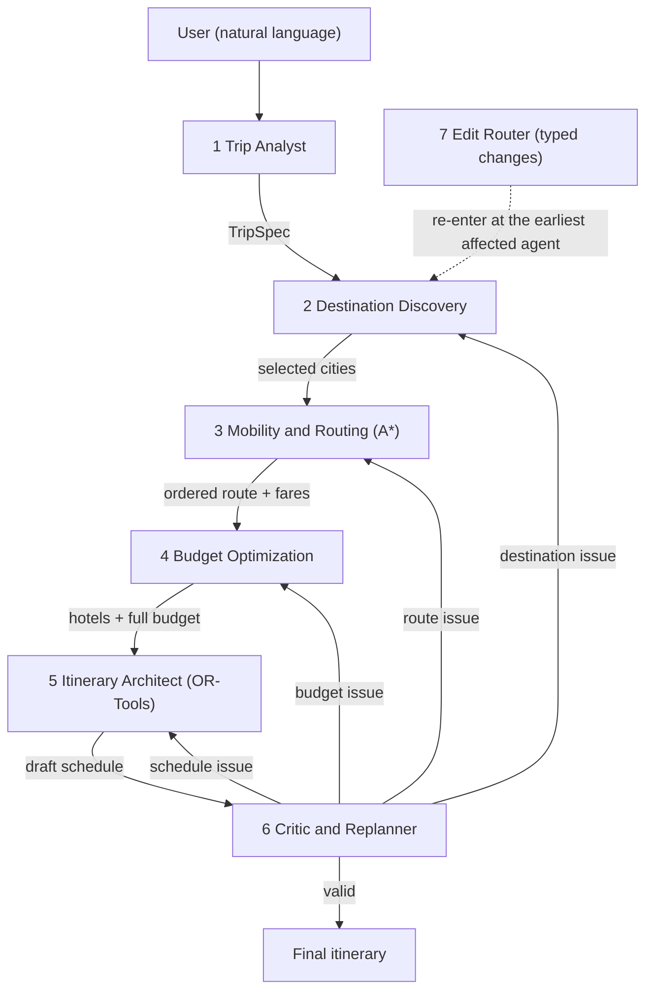

# Odyssey — Review 1: Design Report

Branch `main` (LLM agents with live APIs). The rule-based, no-LLM version is on the branch `simple-deterministic`.

Rubric lines covered: **PEAS formulation** (§3) · **Environment and agent analysis** (§4–5) · **Algorithmic modelling and search strategy** (§6–7) · **Q&A** (§8).

## 1. Introduction

**Problem.** A traveller types a trip in plain language ("5 days in Kerala with 3 friends, ₹40,000, nature and adventure, relaxed pace"). The system returns a day-by-day itinerary: which cities, in what order, how to travel, where to sleep, what to do each hour, and what it costs. When something changes (a road closes, it rains, the budget is cut) or the traveller asks for a change ("make day 2 lighter"), only the part that is affected is redone.

**Objectives**
1. Split the work between agents with distinct roles that share one state.
2. Let a language model make the *choices* (which cities to keep, how to travel each hop, which agent to re-run) while deterministic algorithms make the *computations* (visit order, timetable, prices, score). The model cannot invent totals.
3. Use informed search (A\*) for the visiting order and a constraint solver (routing with time windows) for each day.
4. Replan **only the responsible agent** when a problem is found.

**Scope.** A software system: FastAPI backend, Next.js UI, live services for maps and weather. Hotel, flight and train prices are model estimates, not bookable inventory.

## 2. System overview

| # | Agent | Role | Decides (LLM) | Computes (deterministic) |
|---|---|---|---|---|
| 1 | Trip Analyst | Parser | Region, arrival city, days, people, budget, interests, pace, start date; which values it had to assume | Validates the reply against `TripSpec`, bounds odd values; stops with a clear message if there is no model |
| 2 | Destination Discovery | Explorer | Which cities to keep | Weighted cosine interest score, weather per trip day, sights with fees and hours |
| 3 | Mobility & Routing | Mover | Road, rail or air for each hop; the road vehicle | Road-time graph, weighted A\* visiting order, group prices |
| 4 | Budget Optimization | Money | Hotel tier, which activities to drop | Line items against the ceiling, stay plan, cheapest-damage cuts |
| 5 | Itinerary Architect | Scheduler | Nothing (pace comes from the Analyst) | OR-Tools VRPTW per day, weather per day, multi-objective score |
| 6 | Critic & Replanner | Coordinator | Which one specialist to re-invoke | Budget, schedule, closure, transport and travel-limit checks |
| 7 | Edit Router | Front door for changes | What a typed message means and where to re-enter | Name checks, applies the change to the spec and to standing choices |

Full per-agent cards (inputs, outputs, tools, "must not") are in [`PLAN.md`](../PLAN.md#the-6-agents).

## 3. PEAS formulation

**System performance measure** (shared by all agents, so their goals pull the same way):

`Score = w_p·P + w_q·Q + w_r·R + w_b·B − w_t·T − w_c·C`

P = interest match of the scheduled sights (cosine), Q = their rating, R = route efficiency, B = budget efficiency, T = travel burden, C = unresolved constraint violations. Weights depend on the traveller's archetype (adventure, relaxed, budget, balanced), inferred from their interests and budget.

| Agent | Performance | Environment | Actuators | Sensors |
|---|---|---|---|---|
| **Trip Analyst** | Every stated fact read correctly; every assumed fact reported; no guessed destination | The traveller's sentence; today's date | Writes `trip_spec`; asks a question when no destination is given | Request text; `geocode_location`, `validate_trip_schema` |
| **Destination Discovery** | High interest match; stops close enough to each other; no closed or storm-hit city; enough sights per stop | Candidate cities and sights (model-listed), weather forecast, road times | Writes ranked cities, selected cities, sights | `search_attractions`, `get_directions`, Open-Meteo weather, `score_preference_match`, the Critic's reason when sent back |
| **Mobility & Routing** | Least travel time between stops; no hop above the daily limit unless asked; the mode the traveller wanted; fares that leave budget for the rest | Road network (Mapbox, else OSRM), transport quotes, strikes | Writes the route (order, legs, mode, price) | `get_directions`, `search_public_transport`, `check_transport_disruptions` |
| **Budget Optimization** | Total at or under the ceiling; fewest and least valuable sights dropped; user-chosen hotels kept | Hotel and food prices, fares, the ceiling | Writes the budget breakdown, hotels, stay plan | `search_hotels`, `estimate_food_costs`, `validate_budget` |
| **Itinerary Architect** | Every sight inside its opening hours; meals in their windows; no overlap once travel is counted; free, light and pinned days kept | Opening hours, travel times inside a city, weather per day | Writes the day-by-day schedule and score | Travel matrix, `check_schedule_conflicts`, OR-Tools solver |
| **Critic & Replanner** | Every real problem caught; each sent to exactly one owner; fewest loops; a valid plan accepted | The draft plan, budget, reported events | Writes the validation report; sends the plan back to one agent | `validate_budget`, `check_schedule_conflicts`, `check_weather_disruptions`, `check_transport_disruptions` |
| **Edit Router** | Every change understood and remembered; re-entry no later than the earliest agent whose inputs changed; questions answered without touching the plan | The current plan and one typed sentence | Updates the spec and the standing choices (`EditLocks`); picks the entry agent or answers | `get_plan_day`, `find_in_plan`, `list_alternative_cities`, `geocode_location` |

## 4. Environment analysis

| Property | Classification | Justification | What it forces in the design |
|---|---|---|---|
| Observable | **Partially** | The agents see a forecast, not the weather that will happen; prices are estimates; a road can close after planning | Weather is fetched per trip day; the Critic re-checks after every change; disruptions can be injected |
| Deterministic | **Stochastic** | Forecasts change, and the language model can answer differently to the same prompt | Every model reply is validated against a schema and bounded; totals are computed by code, never by the model |
| Episodic / sequential | **Sequential** | Cities decide the route, fares change the budget, the budget decides what is scheduled | A fixed order of specialists; Budget runs after Mobility so fares are in the total |
| Static / dynamic | **Dynamic** | Closures, storms, strikes and budget cuts arrive after a plan exists; the traveller edits it | Targeted replanning: only the agent that owns the problem re-runs |
| Discrete / continuous | **Discrete** | Cities are graph nodes; time is minutes; tiers are three values | Search over a finite space is well defined |
| Agents | **Multi-agent, cooperative** | Six specialists with different goals share one plan and one score | A shared state and a coordinator (the Critic) for conflicts |
| Rules | **Known rules, discovered facts** | Travel arithmetic and pricing rules are known; which places, hours and fares exist must be looked up | Tools and a model that lists places for any region |

## 5. Agent analysis

A simple reflex agent (condition → action, no memory) cannot plan a trip: whether a sight fits depends on the day already built, and whether a fare is affordable depends on everything already booked.

| Agent | Type | Internal state it keeps | Why not something simpler |
|---|---|---|---|
| Trip Analyst | Model-based, goal-based | The request and today's date | It must decide what was stated and what was assumed |
| Destination Discovery | Goal-based | Ranked candidates, weather per city | It searches for a set of stops meeting the interest and distance goals |
| Mobility & Routing | Goal-based | The road-time graph | It searches for the fastest complete visiting order |
| Budget Optimization | Utility-based | Line items, the previous breakdown | It trades comfort for money by the cheapest damage per rupee |
| Itinerary Architect | Goal-based | The stay plan, weather, opening hours | It finds a consistent timetable, a constraint satisfaction problem |
| Critic & Replanner | Utility-based | The validation report, past directives | It ranks issues by severity and picks the cheapest agent to fix each |
| Edit Router | Model-based | The plan and the standing choices | It must keep an edit alive across later replans |

## 6. Algorithmic modelling

### 6.1 Visiting order — weighted A\* (`backend/algorithms/astar.py`)

Formal problem:

| Element | Definition |
|---|---|
| State | `(current city, set of cities visited, hours travelled today)` |
| Initial state | The start city, nothing visited |
| Actions | Travel to any unvisited chosen city |
| Step cost | Road travel time in hours between the two cities (Mapbox, else OSRM × 1.4) |
| Goal test | Every chosen city visited |
| Path cost | Total hours; a hop longer than the daily limit is penalised in `f` |
| Heuristic | `h(n)` = the cheapest direct edge from the current city to any unvisited city |

`h` is a lower bound on the next hop, and any completion needs at least one more hop, so with `ε = 0` it never overestimates. The search is `f(n) = g(n) + penalty + (1 + ε)·h(n)`. It starts with `ε = 0`; only after 4,000 node expansions does it raise `ε` (in steps of 4, up to 20) so that it always returns a plan. Two consequences to state plainly: within the budget of expansions the order is optimal for travel time, but past it the result is only bounded-suboptimal; and the daily-limit penalty steers the search, so the result is "fastest order that respects the daily limit where possible", not a pure minimum. The search is run from every possible start city and the best kept.

Why a search at all when a maps service exists: a maps service answers "how do I get from A to B". It does not decide the *order* of N cities, which is a travelling-salesman-style problem.

### 6.2 Daily schedule — vehicle routing with time windows (`backend/algorithms/csp_solver.py`)

| Element | Definition |
|---|---|
| Nodes | The day's candidate sights, lunch, dinner, and a depot (the city centre) |
| Time windows (hard) | Each sight's opening hours; lunch 12–14, dinner 19–21 |
| Service time | The sight's duration |
| Travel time | Straight-line distance at city speed between coordinates |
| Optional visits (soft) | Skipping a sight costs a penalty that grows with its duration and the traveller's preference |
| Objective | Minimise total time (travel plus service) and the day's end, while keeping the sights the traveller wants most |

Solved with OR-Tools' routing solver (first solution by cheapest arc, then guided local search, 0.35 s per day). This is a metaheuristic: it returns a good feasible timetable, not a proven optimum.

### 6.3 Other computations

- **Interest match:** cosine similarity between the traveller's seven-theme vector and a city's or sight's profile.
- **Budget:** hotels per room × nights, food priced per region and tier, activities for the sights that fit, transport = the journeys plus a flat daily allowance. Over the ceiling: cheaper hotels first, then the lowest-value paid sights, keeping at least one per city.
- **Score:** the multi-objective formula in §3.

### 6.4 The language model's part

Each specialist runs a tool-calling loop: the model is bound to that agent's tools, may call them for a few rounds, and then returns a JSON decision that is validated. The model **chooses** (a hotel tier, a mode per hop, which agent to re-run); it cannot set a price or a total. Gemini keys are tried first, then Groq; if none answers, planning stops with a message rather than guessing.

## 7. Search strategy justification

**Visiting order**

| Candidate | Complete | Optimal with varying costs | Verdict |
|---|---|---|---|
| BFS | Yes | No: it treats every hop as equal | Rejected |
| DFS | Not on graphs with cycles unless tracked | No | Rejected |
| Uniform-cost search | Yes | Yes | Correct but expands more nodes |
| Greedy best-first / nearest neighbour | No | No: it can strand the last city far away | Rejected |
| Brute-force permutations | Yes | Yes | Grows factorially; fine only for tiny N |
| **A\*** | **Yes** | **Yes at ε = 0** | **Chosen: same optimum as uniform-cost search with fewer expansions** |

**Daily schedule**

| Candidate | Verdict |
|---|---|
| Greedy first-fit by preference | Simple, but ignores opening-hour collisions and can drop meals |
| Exact search / integer programming | Optimal, but slow to set up and tune for soft windows and skipped sights |
| **Routing with time windows (OR-Tools)** | **Chosen: models windows, service times and optional visits directly, and returns a good answer within a time limit** |

**Why this fits the environment.** Dynamic: A\* over a handful of cities and a 0.35-second solve per day are fast enough to re-run after every change. Stochastic: totals and timetables are recomputed by code, so a differently-worded model reply cannot change a price. Partially observable: weather and prices are looked up per trip and re-checked by the Critic.

## 8. Anticipated Q&A

| Question | Answer |
|---|---|
| Why is this multi-agent and not one prompt? | Six roles with different goals and tools share one state; a Critic sends each problem to the one agent that owns it, so a closure re-runs Destination onward and does not restart the parse. |
| What does the LLM do, and what does it not? | It reads the request, chooses tiers and modes, and picks which agent to re-run. Search, scheduling, prices and the score are deterministic code. |
| Why A\* and not BFS? | Hops cost different amounts of time, so BFS is not optimal. A\* returns the same optimum as uniform-cost search with fewer expansions. |
| Is your heuristic admissible? | The cheapest edge to any unvisited city is a lower bound on the next hop, so yes at ε = 0. After 4,000 expansions ε rises and the result becomes bounded-suboptimal; we report that. |
| Why a routing solver for the day? | Sights have opening hours, meals have windows and visits are optional: that is routing with time windows. It is a metaheuristic, so it is good, not proven optimal. |
| What if the model is unavailable? | Planning stops with a clear message and nothing is guessed. A saved sample trip opens without a model. |
| What if a road closes mid-plan? | The traveller reports it; the Critic sends the plan to Destination, which keeps the other cities and replaces that one. |
| How do agents avoid stepping on each other? | Each agent's prompt states what it must not do, the graph fixes the order, and the Critic records and resolves conflicts (for example, a city that Budget cannot afford). Ownership is by convention here, not enforced by the runtime. |
| How do you know it works? | 189 offline tests (a scripted model and a fake Kerala world stand in for the network) and a public traced live run. There is no baseline comparison on this branch. |
| Limitations? | Prices and places are model estimates; free-tier model quota can run out; results vary between runs; the ordering is only bounded-suboptimal past 4,000 expansions; the timetable is a heuristic solution. |
